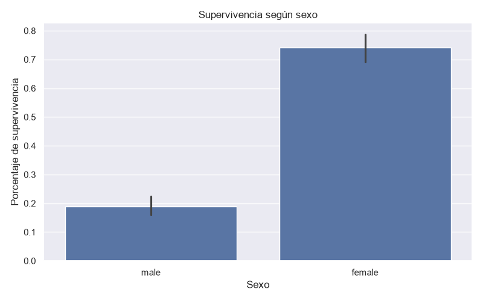
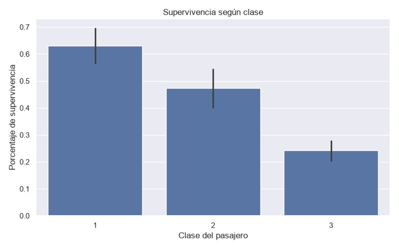

# Análisis de pasajeros del Titanic

## Descripción

Este proyecto realiza un análisis exploratorio de los pasajeros del
Titanic utilizando el archivo `train.csv` del dataset Titanic disponible
en Kaggle.

El objetivo es analizar las características de los pasajeros e
identificar variables que presentan diferencias en la supervivencia.

En esta práctica no se utiliza ningún modelo de Machine Learning. El
trabajo se enfoca en la carga, exploración, limpieza, preprocesamiento,
transformación y visualización de los datos.

## Dataset

El dataset utilizado se obtuvo de Kaggle:

https://www.kaggle.com/c/titanic/data

El archivo utilizado para el análisis es `train.csv`.

El dataset contiene 891 registros y 12 variables originales:

-   `PassengerId`: identificador del pasajero.
-   `Survived`: indica si el pasajero sobrevivió (1) o no sobrevivió
    (0).
-   `Pclass`: clase del pasajero.
-   `Name`: nombre del pasajero.
-   `Sex`: sexo del pasajero.
-   `Age`: edad del pasajero.
-   `SibSp`: número de hermanos o cónyuges a bordo.
-   `Parch`: número de padres o hijos a bordo.
-   `Ticket`: número del boleto.
-   `Fare`: tarifa pagada.
-   `Cabin`: número de cabina.
-   `Embarked`: puerto de embarque.

## Estructura del proyecto

``` text
Titanic-analysis/
│
├── data/
│   └── train.csv
│
├── src/
│   └── analysis.py
│
├── outputs/
│   └── resultados/
│       ├── supervivencia_genero.png
│       ├── supervivencia_clase.png
│       ├── supervivencia_edad.png
│       └── resultados_procesados.csv
│
├── README.md
├── requirements.txt
└── .gitignore
```

## Exploración inicial

Antes de realizar la limpieza se revisaron los siguientes aspectos:

-   Número de pasajeros.
-   Número de columnas.
-   Variables disponibles.
-   Tipos de datos.
-   Valores faltantes.
-   Registros duplicados.
-   Estadísticas descriptivas.

El dataset contiene 891 pasajeros y 12 columnas originales. No se
encontraron registros duplicados.

Los principales valores faltantes se encontraron en las variables `Age`,
`Cabin` y `Embarked`.

## Limpieza y preprocesamiento

### Registros duplicados

Se revisaron los registros duplicados utilizando `duplicated()` y
posteriormente se eliminaron mediante `drop_duplicates()`.

### Variable Age

Para tratar los valores faltantes de `Age`, primero se calculó la
mediana de edad agrupando a los pasajeros por `Pclass` y `Sex`.

Esto permite utilizar una edad representativa de pasajeros que
pertenecen a grupos similares.

Como respaldo, los valores que todavía pudieran permanecer vacíos
después de este procedimiento se completaron utilizando la mediana
general de `Age`.

### Variable Embarked

Los valores faltantes de `Embarked` se completaron utilizando la
categoría más frecuente de la variable mediante la moda.

### Variable Cabin

La variable `Cabin` presenta una cantidad considerable de valores
faltantes. Debido a que no existe información suficiente para determinar
las cabinas faltantes, no se intentó estimarlas.

Los valores faltantes fueron reemplazados por `Unknown`, conservando de
esta manera los registros sin inventar información.

## Variables nuevas

Se crearon tres variables nuevas durante el preprocesamiento.

### FamilySize

Representa el tamaño de la familia del pasajero, incluyendo al propio
pasajero.

La fórmula utilizada fue:

``` text
FamilySize = SibSp + Parch + 1
```

### IsAlone

Indica si el pasajero viajaba solo.

-   `0`: viajaba acompañado.
-   `1`: viajaba solo.

La variable se obtuvo a partir de `FamilySize`.

### AgeGroup

Clasifica a los pasajeros en cuatro grupos de edad:

  Grupo          Rango
  -------------- ------------------
  Niño           Menor de 13 años
  Joven          De 13 a 19 años
  Adulto         De 20 a 59 años
  Adulto mayor   60 años o más

## Análisis realizados

### 1. Porcentaje de supervivencia

Se calculó el porcentaje general de pasajeros que sobrevivieron y el
porcentaje que no sobrevivió.

Para obtener el porcentaje de supervivencia se utilizó la media de la
variable `Survived`, multiplicada por 100.

### 2. Supervivencia según sexo

Se agrupó la información por la variable `Sex` y se calculó el
porcentaje de supervivencia para cada grupo.

El resultado permite comparar la supervivencia entre hombres y mujeres.

### 3. Supervivencia según clase

Se analizó la supervivencia de acuerdo con la variable `Pclass`.

Se compararon las tres clases de pasajeros para observar las diferencias
en el porcentaje de supervivencia.

### 4. Supervivencia según grupo de edad

Se calculó el porcentaje de supervivencia para cada uno de los grupos
creados mediante `AgeGroup`:

-   Niño.
-   Joven.
-   Adulto.
-   Adulto mayor.

### 5. Viajar solo o acompañado

Como análisis adicional se utilizó `IsAlone` para comparar el porcentaje
de supervivencia entre pasajeros que viajaban solos y pasajeros que
viajaban acompañados.

### 6. Tarifa y supervivencia

Como análisis adicional se calculó la tarifa promedio (`Fare`) para los
pasajeros que sobrevivieron y para los pasajeros que no sobrevivieron.

## Visualizaciones

Se generaron tres visualizaciones principales:

### Supervivencia según sexo



### Supervivencia según clase



### Supervivencia según grupo de edad


Las visualizaciones se generan automáticamente y se guardan dentro de
`outputs/resultados/`.

## Resultados y conclusiones

El análisis permitió observar diferencias en la supervivencia de acuerdo
con diferentes características de los pasajeros.

La comparación por sexo mostró diferencias en los porcentajes de
supervivencia entre hombres y mujeres.

También se observaron diferencias entre las tres clases de pasajeros.

El análisis por grupos de edad permitió comparar la supervivencia entre
niños, jóvenes, adultos y adultos mayores.

Además, se compararon los pasajeros que viajaban solos con los que
viajaban acompañados y se revisaron las diferencias en la tarifa
promedio entre pasajeros que sobrevivieron y aquellos que no
sobrevivieron.

Estos resultados representan asociaciones observadas en los datos. No
permiten afirmar que una variable por sí sola haya causado la
supervivencia o el fallecimiento de un pasajero.

## Tecnologías utilizadas

-   Python
-   Pandas
-   Matplotlib
-   Seaborn
-   Git
-   GitHub

## Ejecución

Para instalar las dependencias del proyecto:

``` bash
pip install -r requirements.txt
```

Para ejecutar el análisis:

``` bash
python src/analysis.py
```

El script realiza la exploración inicial, limpieza, tratamiento de
valores faltantes, creación de variables, análisis y generación de
visualizaciones.

Al finalizar, los resultados se guardan en:

``` text
outputs/resultados/
```

El dataset procesado se guarda como:

``` text
outputs/resultados/resultados_procesados.csv
```

## Nota

Este proyecto fue realizado como una práctica de análisis exploratorio
de datos. No se utilizaron modelos de Machine Learning.
